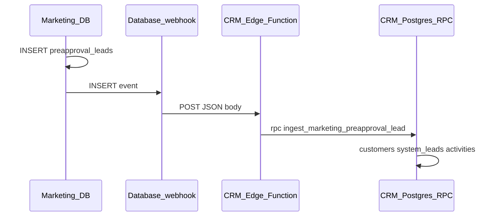

# CRM Edge Function: receive marketing pre-approval webhooks

The **marketing** Supabase project only inserts into `preapproval_leads`. It does **not** talk to the CRM database directly. The CRM must **receive** the HTTP webhook and **call** `ingest_marketing_preapproval_lead` on the **CRM** project with a JSON payload.

If this function is missing, mis-deployed, or strips the JSON body before the RPC, leads will stay in marketing only.

## Flow



## CRM checklist

1. **SQL on CRM (postgres)**  
   Run [`sql/crm/crm_marketing_ingest_bridge.sql`](../sql/crm/crm_marketing_ingest_bridge.sql) so `ingest_marketing_preapproval_lead` exists and `grant execute ... to service_role`.

2. **Edge Function on CRM project**  
   Deploy a function (name should match your marketing webhook URL), e.g. `ingest-marketing-preapproval`.

3. **CRM secrets (Edge Function)**  
   - `MARKETING_WEBHOOK_SECRET` — same value you put in the marketing webhook header `X-Marketing-Webhook-Secret`.  
   - `SUPABASE_URL` — CRM project URL (often auto-set).  
   - `SUPABASE_SERVICE_ROLE_KEY` — CRM service role (often auto-injected as `SUPABASE_SERVICE_ROLE_KEY`).

4. **Marketing webhook**  
   POST to: `https://<CRM_PROJECT_REF>.supabase.co/functions/v1/ingest-marketing-preapproval`  
   Header: `X-Marketing-Webhook-Secret: <secret>`  
   Body: default Database Webhook payload (must include **`record`** with the new row).

5. **Verify**  
   - Marketing: **Database → Webhooks → your hook → Delivery logs** (200 vs 401/500).  
   - CRM: **Edge Functions → Logs**.  
   - CRM: SQL `select * from crm_system_leads order by created_at desc limit 5;`

## Reference implementation (Deno)

Use this as the **entire** `index.ts` for `supabase/functions/ingest-marketing-preapproval/` on the **CRM** repo/project. It forwards the **full** webhook JSON to the RPC (do not pick only a few fields).

```typescript
import { createClient } from "https://esm.sh/@supabase/supabase-js@2";

const corsHeaders = {
  "Access-Control-Allow-Origin": "*",
  "Access-Control-Allow-Headers": "authorization, x-client-info, apikey, content-type, x-marketing-webhook-secret",
};

Deno.serve(async (req) => {
  if (req.method === "OPTIONS") {
    return new Response("ok", { headers: corsHeaders });
  }
  if (req.method !== "POST") {
    return new Response("Method Not Allowed", { status: 405, headers: corsHeaders });
  }

  const expected = Deno.env.get("MARKETING_WEBHOOK_SECRET");
  const got = req.headers.get("X-Marketing-Webhook-Secret") ?? req.headers.get("x-marketing-webhook-secret");
  if (!expected || got !== expected) {
    return new Response(JSON.stringify({ ok: false, error: "Unauthorized" }), {
      status: 401,
      headers: { ...corsHeaders, "Content-Type": "application/json" },
    });
  }

  let payload: unknown;
  try {
    payload = await req.json();
  } catch {
    return new Response(JSON.stringify({ ok: false, error: "Invalid JSON" }), {
      status: 400,
      headers: { ...corsHeaders, "Content-Type": "application/json" },
    });
  }

  const url = Deno.env.get("SUPABASE_URL");
  const key = Deno.env.get("SUPABASE_SERVICE_ROLE_KEY");
  if (!url || !key) {
    return new Response(JSON.stringify({ ok: false, error: "Missing SUPABASE_URL or SUPABASE_SERVICE_ROLE_KEY" }), {
      status: 500,
      headers: { ...corsHeaders, "Content-Type": "application/json" },
    });
  }

  const supabase = createClient(url, key, { auth: { persistSession: false } });

  const { data, error } = await supabase.rpc("ingest_marketing_preapproval_lead", {
    p_payload: payload as Record<string, unknown>,
  });

  if (error) {
    console.error("ingest_marketing_preapproval_lead", error);
    return new Response(JSON.stringify({ ok: false, error: error.message }), {
      status: 500,
      headers: { ...corsHeaders, "Content-Type": "application/json" },
    });
  }

  return new Response(JSON.stringify(data ?? { ok: true }), {
    status: 200,
    headers: { ...corsHeaders, "Content-Type": "application/json" },
  });
});
```

### Important

- Pass **`payload` as received** (the whole webhook JSON). The SQL function unwraps `message`, stringified `body`, `record`, `data`, `new`, and reads snake_case or camelCase.
- Do **not** rebuild a smaller object with only `id` / `marketing_lead_id`, or columns will stay empty in the CRM.
- **Marketing → CRM via `pg_net`**: requests often show `User-Agent: pg_net/0.20.0`. Ensure `net.http_post` (or your trigger) sets **`body` to the same JSON** the Database Webhook would send (including the full `record` object). If you pass only the new row, wrap it as `{"type":"INSERT","table":"preapproval_leads","schema":"public","record":{...full row...},"old_record":null}`.
- **Duplicate webhooks** (same `marketing_lead_id` already in `crm_system_leads`): the RPC **updates** `crm_public_preapproval_leads` and `crm_customers` with the latest parsed payload instead of returning early, so retries or fixed payloads can **backfill** rows that were first ingested with bad data.

## Manual test (CRM SQL Editor)

As `service_role` you cannot run arbitrary RPC from the dashboard easily; use **Edge logs** or invoke the function with `curl`:

```bash
curl -sS -X POST "https://<CRM_REF>.supabase.co/functions/v1/ingest-marketing-preapproval" \
  -H "Content-Type: application/json" \
  -H "X-Marketing-Webhook-Secret: YOUR_SECRET" \
  -d '{"type":"INSERT","table":"preapproval_leads","record":{"id":"<uuid>","display_name":"Test User",...}}'
```

Use a real `id` UUID and minimal valid fields matching what marketing inserts, or copy a row from marketing as JSON.
